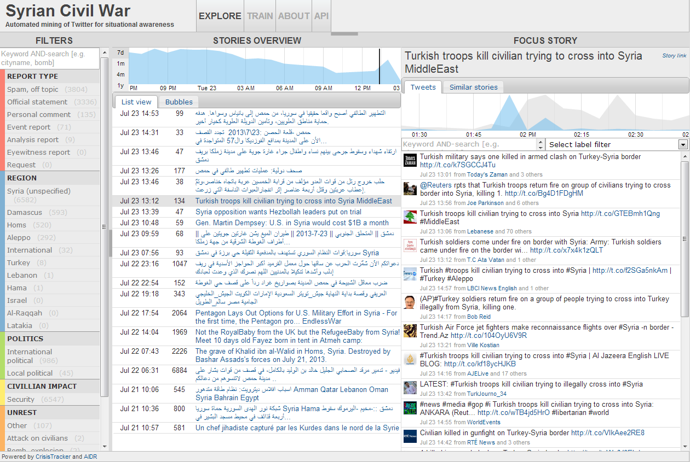

# CrisisTracker

CrisisTracker is a software platform that extracts situational awareness reports from torrents of public tweets during humanitarian disasters. It combines different kinds of automated processing with crowdsourcing to quickly detect new events and bring together related evidence into stories.

As of 2016, the project is no longer maintained, as there is no funding and I need to pay the bills. Contact me if you are interested in sponsoring further development. -[Jakob Rogstadius](https://www.linkedin.com/in/jakobrogstadius/)

## Distributed sensing via social media

During humanitarian crises in recent years, online social media (mainly Twitter, Facebook and YouTube) have emerged as a means for affected local populations to communicate their experiences to the world. With increasing technology adoption and public access to most posted messages, it is now possible to tap into real-time reports from thousands or millions of people on the ground.

The Twitter microblogging service saw 500 million tweets being posted daily in October 2012, by over 200 million active users. Unlike for instance Facebook and SMS, the vast majority of these tweets is shared publicly and can be accessed in real-time though an application programming interface (API). The challenge however is sense-making. With so much content being generated, maintaining overview and history, and detecting patterns and actionable information, requires specialized information management tools. This is what CrisisTracker aims to provide.

## Technology

The CrisisTracker platform uses an automated real-time clustering algorithm based on Locality Sensitive Hashing (LSH) to group together tweets that are textually very similar. A cluster of messages (a "story") typically refers to a single well-defined event, such as artillery shelling of a location, a disease outbreak in a refugee camp, a bombing, etc.

Although individual tweets are both extremely brief (maximum 140 characters) and difficult to verify independently, stories in CrisisTracker capture the event from multiple angles and provide a real-time index of published evidence in the form of images, video and news articles.

Events during a time period can be summarized by looking at those stories that were mentioned by the highest number of Twitter users.

**Technologies by module**
* The clustering back-end is implemented in C# and MySQL
* The [machine learning](http://aidr.qcri.org/) module uses Java, Weka, MySQL and Redis
* The web front-end uses [d3](http://d3js.org/) (for content) and jQuery (for [page layout](http://layout.jquery-dev.net/documentation.cfm) and [tabs](http://jqueryui.com/tabs/)), with a PHP/JSON API

## AIDR Integration

[AIDR](http://aidr.qcri.org/) - Artificial Intelligence for Emergency Response - is an open-source platform developed at QCRI that provides automated real-time topic classification of document streams. It is a supervised classifier, meaning that it learns how to classify documents based on examples provided by human curators.

The AIDR platform has been integrated into CrisisTracker to provide the topic filters seen on the explore page. You can help teach the system how to better classify content by visiting the training page.

## Free and open source

CrisisTracker is free and open source, so that you can deploy your own instance or integrate it with your own analysis software. The developers will be happy to hear from you if you set up a deployment!

## Resources

* [Example deployment](http://ufn.virtues.fi/crisistracker)
* [Installation instructions](https://github.com/JakobRogstadius/CrisisTracker/wiki/Installation-instructions)
* [Publications](https://github.com/JakobRogstadius/CrisisTracker/wiki/Publications)
* More documentation is available on the [wiki](https://github.com/JakobRogstadius/CrisisTracker/wiki)

## Contact

Please contact [Jakob Rogstadius](https://www.linkedin.com/in/jakobrogstadius/) for inquiries.

## Acknowledgements

Development of CrisisTracker has been made possible through funding and computational resources by M-ITI, IBM Research, University of Oulu and QCRI.

Active contributors:

* None

Past contributors:

* [Jakob Rogstadius](http://hci.uma.pt/~jakob) - Lead developer
* [Claudio Teixeira](http://www.claudioteixeira.com/) - Developer
* [Vassilis Kostakos](http://www.ee.oulu.fi/~vassilis/) - Advisor
* [Maja Vukovic](http://researcher.watson.ibm.com/researcher/view.php?person=us-maja) - Advisor
* [Taha Kass-Hout](http://www.humanitariantracker.org/#!aboutus/csgz) - Advisor
* [Evangelos Karapanos](http://ekarapanos.com/) - Advisor
* [Ko-Hsun Huang](http://www.linkedin.com/profile/view?id=156209073&locale=en_US&trk=tyah) - Advisor
* [Carlos Castillo](http://www.chato.cl/research/) - Advisor
